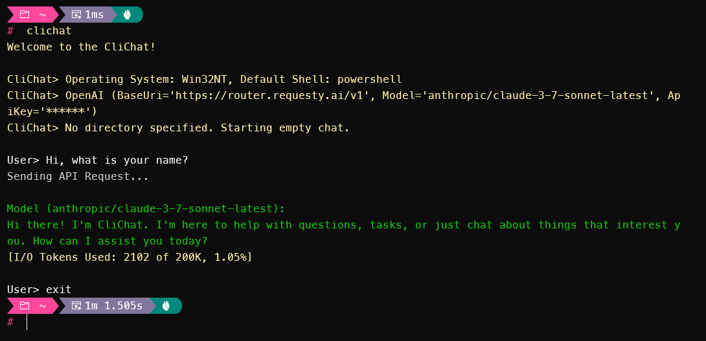

# Cli Chat

An interactive command-line chat application that leverages OpenAI-compatible APIs to provide conversational AI capabilities. This application features streaming responses, Markdown file processing, and real-time token usage tracking.

## Features

- Interactive chat interface with streaming AI responses
- Support for OpenAI-compatible API providers
- Automatic operating system detection and shell configuration
- Optional Markdown file processing with smart chunking for large files
- Real-time token usage monitoring (against 200K token limit)
- Cross-platform support (Windows, MacOS, Linux)
- Built-in help command (`-h` or `--help`)

## Screenshot



## Prerequisites

Before running the application, ensure you have:

- .NET SDK installed
- Access to an OpenAI-compatible API provider
- Required environment variables configured:
  - `OPENAI_API_KEY`: Your API key
  - `OPENAI_API_BASE`: Base URL for your API provider
  - `OPENAI_API_MODEL`: Model ID to use for chat completion

## Setup

1. Create a new console application:

   ```bash
   dotnet new console -n CliChat
   ```

2. Add required packages:

   ```bash
   dotnet add package Microsoft.Extensions.AI --prerelease
   dotnet add package Microsoft.Extensions.AI.Abstractions --prerelease
   dotnet add package Microsoft.Extensions.AI.OpenAI --prerelease
   ```

3. Configure environment variables with your API provider details

## Usage

```bash
clichat [directory]
```

### Arguments

- `directory`: Optional path to directory containing markdown files to load

### Options

- `-h, --help`: Show help message

### Examples

```bash
clichat                  # Start with no files loaded
clichat ~/docs          # Load markdown files from ~/docs
clichat "C:\My Docs"    # Load markdown files from Windows path
```

### Chat Interface

- Start typing your messages after the `User>` prompt
- AI responses will stream in real-time with green text
- Token usage information is displayed after each interaction
- Exit the chat by typing `exit`, `quit`, or pressing Enter with no message

### Markdown File Processing

When a directory is specified, the application processes all Markdown files from that location:

- Files are loaded at startup
- Large files (>10,000 words) are automatically chunked for processing
- File contents are incorporated into the chat context
- Progress and token usage are displayed during processing

### Token Usage Monitoring

- Current token usage is displayed after each interaction
- Shows usage as count and percentage of 200K token limit
- Helps manage conversation length and context

## Exit

To exit the application:

- Type `exit` or `quit`
- Press Enter with an empty message
- The application will cleanly terminate

## References

Based on examples from the [dotnet ai-samples Github repo](https://github.com/dotnet/ai-samples/blob/main/src/microsoft-extensions-ai/openai/OpenAIExamples/Streaming.cs) for Microsoft.Extensions.AI
